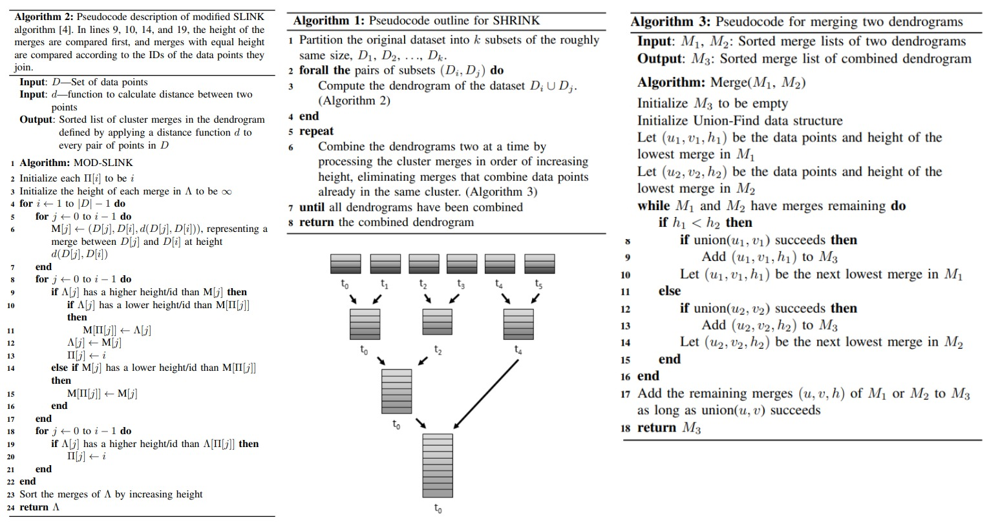
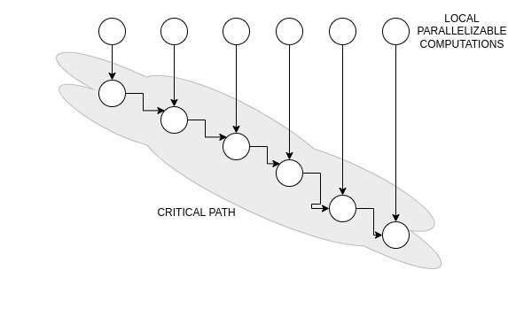
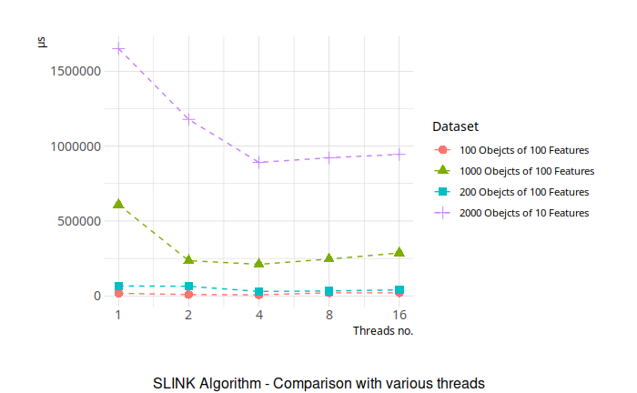
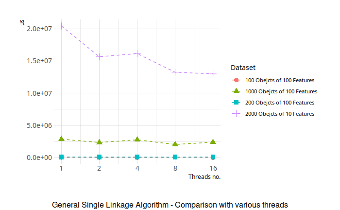

# Hierarchical Clustering - High Performance Computing

## Author
Hernest Serani

Developed as final project for High Performance Computing course.
Ca' Foscari Univeristy of Venice 2022
Masters in Software Dependability and Cyber Security

## Table of contents
* Overview
* General Single Linkage Algorithm
* SLINK Algorithm
* Optimization techniques
  * Initial problems, strategies and limitations
  * Optimal data layouts (distance matrix)
  * Possible Multithreading Approaches
  * Dependency Graph
  * SIMD Vectorization
  * Compilation flags
* Results
  * Comparison with various Threads - SLINK
  * Comparison with various Threads - General Single Linkage
  * Speedup
  * Further Optimizations

# Overview
Clustering is an unsupervised classification task (no classes known in advance). After clustering, we can consider a cluster as a class. In this project, I have implemented two algorithms used for hierarchical clustering. The first one is called General Linkage Clustering and runs in $O(N^3)$ time complexity, and $O(N^2 + overhead)$ space complexity. This is a more intuitive and simple algorithms, but there exists a better algorithm called SLINK, which has $O(N^2)$ time and $O(3N)$ space complexity. Both these algorithms as input need a distance matrix, which represents the distances between each two points of the input data. In order to calculate this matrix, we can use the Euclidean Distance which runs in $O(M*NlogN)$ to calculate the distances among all N points of M features each. Important to note is that for performance purposes, we can take only the bottom diagonal part of the matrix, because it will be a symmetric matrix on the main diagonal.
Applications of this algorithm can be in various fields such as biology (relations between species) or computer science (social network analysis).
Since we need to work with the similiary between two points, there are different ways to compute similarities. The similarity is given in distance, the smaller this distance, more similar are the two objects. In this implementation I used the Euclidean Distance.
The most simple case is when we have to single points, which, even if they are considered clusters, the calculation of the distance is straight forward by applying the Euclidean algorithm, but in case of clusters composed of more than 1 point, there are some ways to compute the similarity between two clusters such as single linkage, complete linkage, average linkage, etc. In this implementation, I have used the single linkage, which is based on the closest two points distances in order to calculate the similarity of the two clusters. The disadvantage of this linkage is that it overestimates similarities, but its straight forward and can be imeplemented efficiently.

Finally, a clusterized dataset can be represented by a dendogram, which is a data visualization graph which shows the distance among clusters, the clusters themselves, and subsclusters of a cluster. It is easily human readable and intepreted. Although, the two algorithms I have implemented show different output and don't render a dendrogram, but using some math oriented programming languages such as matlab or R, can be easily converted into a dendrogram. The general single linkage algorithm returns a string representation in a nested form as pairs recursively, and their respective distances. The SLINK algorithm, has a different approach of showing the output which uses two vectors $\pi$ and $\lambda$ (discussed below).
 
# General Single Linkage Algorithm
This is a non-efficient implementation to solve the hierarchical clustering problem. We start by calculating the distance matrix from data matrix using the Euclidean distance. On each cell $i, j$, we place the distance between point $i$ and $j$. Then we perform as many iterations as there are objects in the cluster. On each iteration we work with the distance matrix. The first step is to find the two points that currently share the minimum distance among each-other (having the minimum distance means the two most similar points, and therefore more close to each other). Since theese two points (can be a cluster aswell), are close, we merge them together to form a new cluster, so basically this is done by removing the corresponding 2 rows and 2 columns from the distance matrix and adding a new row and column representing the new formed cluster. To be efficient, we can simply replace the content of one of the rows and respective column, and remove the other row and column from the distance matrix. This is done to evitate two operations which are the deletion of the whole row and column, and the addition of a completly new row and column. After this operation, we need to update the distance matrix because, forming a new cluster means having new distances between this cluster and all the other clusters. For this operation we just need to update a single row and column instead of the whole distance matrix. Note, the distance matrix has as main diagonal all $0$s, because the distance between a point/cluster and itself is always zero.

# SLINK Algorithm
This is the most optimal algorithm to find the hierarchical clustering clusters, and when combined with other techniques such as SIMD Vectorization, loop unrolling, mulithreading (discussed next) gives some great results which are shown at the end.
The problem with the previous naive algorithm is that the distance matrix is updated on each iteration, which of course has a cost since its multidimensional. This algorithm exploits this weakness by using only once the distance matrix. The algorithm is very simple and is given by the follosing pseudocode.

```
1. Set π(n+1) to n+1, λ(n+1) to ∞
2. Set M(i) to d(i, n+1) for i=1,...,n
3. For i increasing from 1 to n
      if λ(i) ≥ M(i)
          set M(π(i)) to min {M(π(i)), λ(i)}
          set λ(i) to M(i)
          set π(i) to n+1
      if λ(i) < M(i)
          set M(π(i)) to min {M(π(i)), M(i)}
4. For i increasing from 1 to n
      if λ(i) ≥ λ(π(i))
          set π(i) to n+1
```

The above procedure is repeated for each n from $1$ to the number of objects to be clusterized. The $M$ is a vector which holds the distances of the current point ($n$) to all the other objects, so $M(i)$ is the distance from cluster $n$ to cluster $i$. 
SLINK is very efficient in terms of both space and time complexity. The only data structures to be held are the $\pi$ and $\lambda$ vectors and the auxilliary $M$ vector, which in total are $O(3N)$. The all idea  is built upon the two vectors, which if combined, we call it a pointer representation of a point for eaach pair of values.
The domain and codomain ranges of the two functions are given as:
$$\pi (i): (i \in [1,N] \rightarrow [1, N])$$
$$\lambda (i): (i \in [1,N] \rightarrow [0, \inf])$$

The value of $\pi(i)$ represents the number of the largest id of cluster which is merged with $i$ at distance $\lambda(i)$ (which is the smallest), and in other words, that value is the largest id among all objects in that cluster. Basically the id of a cluster is the highest id on that cluster.

To apply this algorithm, we need to have the distance matrix, which can be obtained using the same algorithm described in the general single linkage algorithms. After obtaining it, we apply $n$ times the procedure shown above. The iterations are done on the dataset objects. On each iteration, we set to $\inf$ the corresponding value of the $\lambda(i)$ (because the smallest distance to any other cluster is unknown yet), and its just "paired" with itself. Then we obtain from the distance matrix, all the distances from this object to all the other objects, and store them to the vector $M$. Using an inner loop we loop through all the objects starting from the first one, till our previous one (based on the id). If their smallest distance to any cluster, is larger then the distance with us, we need to update its data, because it has us as nearest point. First we update our own vector of at position $\pi(i)$ which is the positon of the point which is currently paired with the one we want to pair. We set this value to the minimum between the current one and our distance to the goal point ($\lambda(i)$). This is done so we can take the updated value in consideration during the next iterations where $M$ is used, in order to always have the smallest distance updated. The reason is because, if we can reach the new goal point $x$ through a distance $d_x$, and that point ($x$) can reach another one $y$ through a distance $d_y$ (kind of transitivity), this means that we can also reach $y$ using the smallest distance between these two. Then we just update the distance of the goal point, to our distance with that (because we are hid nearest point), and his pair point (which is our id). Otherwise if our distance between us and that point is higher than its current distance to his nearest point, this means that we are not its closest point, but there is another one, and we have to update our $M$ vector at the position which represents the paired point of the current iteration's point to the minimum between us (distance from us to that point) and its current value. This way we are always kept updated (useful for further iterations). At the end we loop again through all the objects which have a smaller id than ours, and update their neighbour to our id if their current min distance with any other point is greater than the distance from us to their "pair". This algorithm outperforms the previous one.

# Optimization techniques

## Initial problems, strategies and limitations

For this problem, I have implemented both the algorithms, and noticed the importance of SLINK's complexity during execution. The first algorithm was more intuitive in terms of applied problem solving, while the second one was relatively easy to convert into code from the pseudocode. In this section I will describe what went wrong during the process of the optimization, and the alternative strategies I followed to achive the same thing.
### Limitation 1: Proprietary Intel library for math operations
My idea was to vectorize the function which calculates the Euclidean distance. Since its a function which uses single precision floats (32 bits), and I wanted to vectorize the loop in order to perform $16$ floats at the same time ($512/32$) I started looking into the documentation of Intel Instrinsics. The function which fits my needs was `__m512 _mm_pow_ps (__m512 a, __m512 b)`, which as name suggests, computes the exponential value of 32-bit floating point `a` raised to `b`. Unfortunately, this was part of the SVML (Short Vector Math Library), which is a properitary library. Its confusing because it uses the same naming schema starting with `_mm_` as intel intrinsics functions. One solution was to import the whole library inside the project but this would have caused a mess and unnecessary other imports. This was limiting me to also implement other functions which depended on this, but I found another solution, using OpenMP, discussed below.
### Limitation 2: Pointers instead of data passing
A detail which I was missing at the beginning, was that I was passing the whole data from a function to another. This is a pretty basic thing and can be fixed by moving pointers which point to the allocated data in the heap. This simple detail didn't catch my eye, but fortunately I noticed it, and this were causing a lot of overhead from data passing from heap to the stack during function calls. The reason I mentioned this, is, to show how some stupid things in terms on "not paying attention to details" can cause a huge overhead. 

## Optimal data layouts
Typically, an algorithm operates on a data structures, and its very important to have a good layout of these data structures in order to reduce unnecessary computations and optimize them. In our case, the distance matrix is a symmetric matrix, which means that half of its size is redundant. Maybe this is not important because the space complexity remains still $O(N$2)$, but its a good thing to optmize as much as possible. So, for this reason, instead of saving the whole matrix, I saved the lower part of it.

## Possible Multithreading Approaches
Even single threaded, the SLINK algorithm has great performance and outperforms the general single linkage, but we should take advantage of multicore processors in order to distribute instructions among threads. In order to find the optimal number of threads, we need to do some testing and calculate the speedup by comparing the parallel algorithm with the best sequential one.
### Limitation 1: Dependent for iterations
Since the SLINK algorithm has some dependencies on the main iteration (the outer one), because each iteration of the points, depends on values calculated by previous iterations which are the $\lambda$ and $\pi$ vectors of data, we cannot parallelize it directly. The same thing for inner loop (instruction block 3 from the pseudocode).
### Limitation 2: Handling same memory access
Since the value of $M$ is a shared value and continously modified and read by various threads, its a huge problem when it comes to parallelization, since the operations are not atomic. To overcome it, I had 3 options. 
  * Using a critical section
  This is straight forward, just place a critical section where the M is shared. But, it will cause a huge overhead since almost all instruction inside the loop make use of the shared variable M. I tried to see what happens and I noted a worse performance, coming from the lock and unlock inside each thread. First of all this does not simply make use of parallelization, but will make the performance worse because of the waits on each thread to get the lock and continously check if its free.
  * Using flush
  To syncrhonize the memory value of M, another approach is using the flush directive of OpenMP, but the problem was another one. Since I make use of SIMD instructions on the for loop, OpenMP gives error if you use OpenMP constructs inside blocked marked as SIMD vectorized. I had two options, either remove the SIMD or remove the flush. The SIMD is very useful and I had to chose it instead of the flush, which still would have caused overheads.


I tried to parallelize instructions from the original algorithm, but I saw no big performance improvements. After some reseaarch I found out another algorithm for Parallel clustering (shown below). I tried to implement it in C++ but I wasn't able to fully implement it. It is based on a divide and conquer approach which divides the dataset into pieces and merges them using algorithm `3` after using a modified SLINK version (`2`). 




### Dependency Graph
The reason why the sequential algorithm can't be fully parallelized is because all the iterations are dependent on all the previous iterations, which makes the parallelization not possible. The dependency graph is shown below, where we can see a critical path long `n` (number of points).




### Parallelization of other instructions

Since for the above reason I couldn't apply parallelization on the 3rd block of the algorithm, I applied parallelization on the second and fourth for loop. These loops share no dependencies and can be parallelized perfectly. The scheduling I chose is dynamic, which is good for load balancing of the thread tasks. So when a thread finishes, it starts pulling tasks of other threads. In theory, since all the operations on each loop are constant from the computational point of view (require same amount of time), the static scheduling would have worked perfectly aswell. So using, `#pragma omp parallel for simd schedule(dynamic)` we spawn some threads, which will dynamically take chunks of the for loop and assign them to threads in order to achieve parallelism.

Apart the main SLINK algorithm, I applied the same approach to the function which calculates the Euclidean distance. For each distance to be calculated (remember, we are working on the lower triangle part), we spawn a thread which calculates the Euclidean distance between two points. The scheduling is dynamic, and we have to define the shared varibles in the directive. Internally for each two points distance, I used SIMD instructions for vectorization of features of each point.

The same idea is applied for other parallelizable loops of the general single linkage implementation and the utility functions.

## SIMD Vectorization

As mentioned above, SIMD Vectorization is useful and its like free optimization for todays processors. Basically, since single floating points are 32 bit, todays registers can hold data which are larger such as 128, 256 or even 512 bit. So a single instruction is applied to a vectorized data. This can be extended for multiple instructions of course. Since OpenMP 4, we can use OpenMP to define SIMD instructions which are automatically going to be vectorized and converted to Intel Instrinsics instructions. One of the functions I started "hard-coding" to Intel Intrinsics instructions, was the Euclidean distance function. Unfortunately, the power function was in a proprietary library and I couldn't use it, and it would have penalized for further instructions. So I used the `#pragma simd` directive which would translate them into simd during compile time. SIMD insturctions, exploit the locality of the data. OpenMP automatically can spot auto-vectorization patterns, and convert them to simd, but it won't give an error if we have dependent data.
I applied this idea to the Euclidean distance function. Below are the handcrafted SIMD instructions, but I prefered to use OpenMP.

```c
static float euclideanDistance(Features p1, Features p2) {
    assert(p1.size() == p2.size());
    const unsigned long size = p1.size();
    float result;
    __m512 m_sums = _mm512_setzero();
    for (int i = 0; i < size; i+=(512/32)) { // loop through all the features of the point
        __m512 m_p2 = _mm512_loadu_ps(&p2[i]);
        __m512 m_p1 = _mm512_loadu_ps(&p1[i]);
        __m512 m_diff = _mm512_sub_ps(m_p2, m_p1);
        __m512 power = _mm512_pow_ps(m_diff, _mm512_set1_pd(2));
        m_sums = _mm512_add_ps(m_sums, power);
    }
    __m512 m_sqrt = _mm512_sqrt_ps(m_sums);
    _mm512_storeu_ps(&result, m_sqrt);
    return result;
}
```
is converted to:

```c
static float euclideanDistance(Features p1, Features p2) {
    assert(p1.size() == p2.size());
    float sums = 0;
    #pragma openmp simd
    for (int i = 0; i < p1.size(); i++) { // loop through all the features of the point
        float diff = p2[i] - p1[i];
        sums = sums + powf(diff, 2);
    }
    return sqrtf(sums);
}
```

The same logic is applied for all the other blocks which can be vectorized, such as the ones inside the SLINK algorithm.
During the test phase, I found out that the `-O3` flag automatically performs vectorization whatever you write (of course when possible).

## Compilation Flags
Finally, some free automatic optimization can be obtained just by adding a simple flag `-O3` during compilation. It enables a lot of optimizations such as instructions rearrangement (obviously taking in consideration the dependencies), loop unrolling, vectorization and a lot more. The full list is [here](https://gcc.gnu.org/onlinedocs/gcc/Optimize-Options.html).
We have some restirctions although, such as avoidance of pointers. In the folling section, we will see comparisons among various threads, and with or without the `-O3` flag.


# Results

**NOTE**: The algorithm is not fully parallelized and its performance is still close to the sequential one. I tried to implement algorithms from various papers but they had some specifications and it was not that easy to convert them in C++.

Tests were done with three types of dataset:
* Fixed small dataset - for correctness purposes
* Natural dataset - comparing how the algorithm reacts with various threads
* Artificial dataset - randomly generated datapoints to take an average

The below result is from a dataset with 1000/2000/100/200 points each with 10/100 featyres.

## Comparison with various Threads - SLINK



First of all we can notice the performance of SLINK ($O(n^2)$) against the General Single Linkage ($O(n^3)$).
Since the test was done on an intel CPU with 4 physical cores, and since parallel threads dont do any wait, I was expecting to get the optimal execution time at 4 threads. This expected result matches with the testing. The parallel SLINK operates better at 4 threads. If we start increasing the number of threads, it wont further improve, but will start losing performance caused by overheads of thread creation. For a dataset of 1000 points with 10 features, we can see that the parallel solution works 3 times better. I expect the complexity to go $O(n^2/4)$ (almost, since not everything is parallelized) when using 4 threads. 

## Comparison with various Threads - General Single Linkage



For the General Single Linkage, the results were a bit unexpected, because we can see that its very unstable and operates bettwe with a big number of threads. When we use 32 threads, it will start drastically decresing the performance. So the optimal number of threads is 8 or 16 for my parallel single linkage.

## Speedup

The speedup is given as $S = T_s / T_p$ where $T_s$ is the execution time of the best sequential algorithm. 
If we take the results of the 1000 objects, we obtain a speedup of $S = 3$ for 4 threads, which is not the best one since there are other parallel algorithms with better speedup. 
To calculate the efficiency, we use $E = S / p$, and in out case, it is $75\%$ since we have are using 4 cores simulataneously. 
